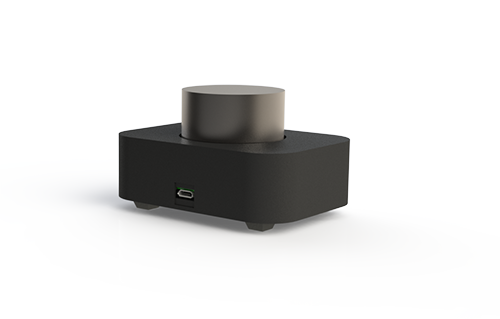

# RPi Pico Volume Controller

Turn a Raspberry Pi Pico into a media control device for PC.
Allowing for volume control and play/pause functionality in a stylish self-contained package.

---

## Getting Started

**Parts List:**

* 3D Printed `hardware/enclosure-base`
* 3D Printed `hardware/enclosure-lid`
* 4x M2 Threaded Knurled Heatset Inserts
* 2x M3 Threaded Knurled Heatset Inserts
* EC11 Rotor Encoder or Similar
* 4x M2x3 screws
* 2x M3x6 screws
* 4x 12x12mm rubber adhesive feet
* 44mm Aluminium Rotor Encoder / Potentiometer Knob
* Raspberry Pi Pico
* Ribbon Cable
* 2x 5mm LEDs (Optional)

Except the custom 3d printed parts, all the components can be obtained via Aliexpress.

### Setting up the enclosure

The enclosure is a 2 piece design designed to be 3d printed.
The `enclosure-lid` is installed with m2 heatset inserts for securing the raspberry pi, as well as m3 heatset inserts to securing the base.
There are optional cutouts in the LID to fit standard 5mm LEDs to achieve an illuminated ring under the control knob.

### Wiring the rotor encoder

The A/B encoder inputs can be directly connected to the GPIO pins 12,11.
Note getting these around backwards (A -> 11, B -> 12) will reverse the volume control direction.
Center ground pin must be connected to the Pico ground.
The switch pins of the encoder should be connected between GPIO Pin 14 and ground.

### Setting Up The MicroController

This project uses [CircuitPython](https://circuitpython.org/) for the helpful HID libraries.
Circuit python must be installed on the Pico prior to loading the firmware from this repo.
There are also several [adafruit libraries](https://circuitpython.org/libraries) used, these files should be copied into the `lib/` subdirectory after circuit python is installed.

* `adafruit_hid\` - Folder contains the Human Interface Device libs.
* `adafruit_debouncer.mpy` - Used to debounce switch input.
* `adafruit_ticks` - Used for timing within the debouncing lib.

The contents of the `firmware/` subdirectory should be copied into the root directory of the Pico device.

Note: The storage device is disabled on the next hard boot of the Pi, to disable this behaviour for update or development short Pin 13 to ground on boot.

---

## Contributing

Any contributions are welcome.
The `requirements-development.txt` file should be installed on a dev python environment to ensure your IDE has typing stubs to introspect your source.

`deploy.py` is provided as a simple helper script to allow automation of loading new code from the repo onto a device for test, this can be configured to run via your IDE.
Pass a directory argument for your Pico when calling the `deploy` script.

To expose the storage device for development you need to short the GP13 pin to ground on boot, generally for development you want a permanent short between these pins.

Pre-Commit is used to automate linting and formatting on the repository.

---

I just do this stuff for fun in my spare time, but feel free to:

---

## License

The source of this repo uses the MIT open-source license,
for details on the current licensing see:
[LICENSE](https://github.com/CreatingNull/RPI-Pico-Volume-Controller/blob/master/LICENSE.md)
or click the badge above.
